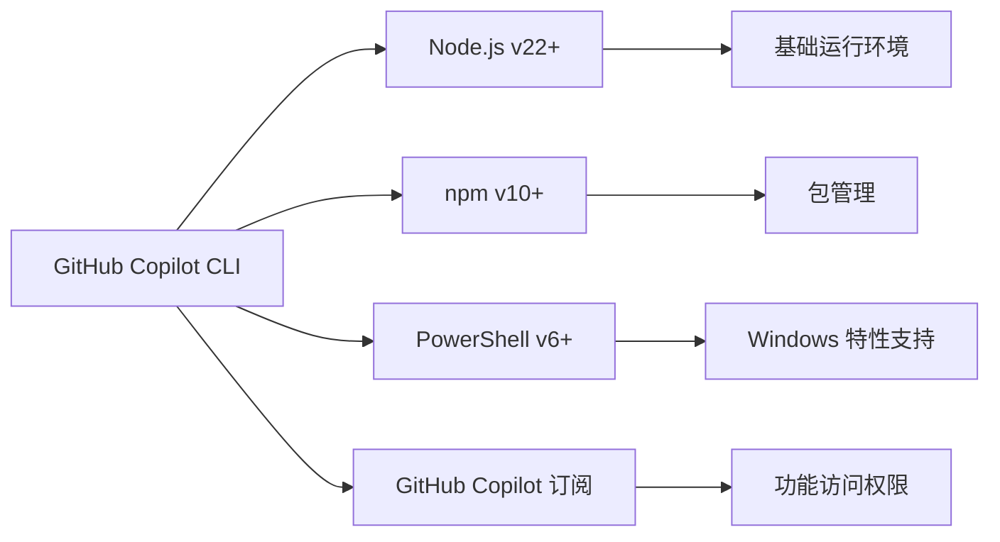
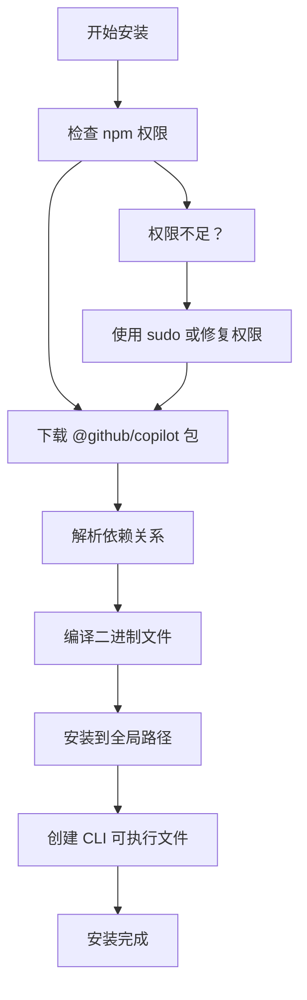
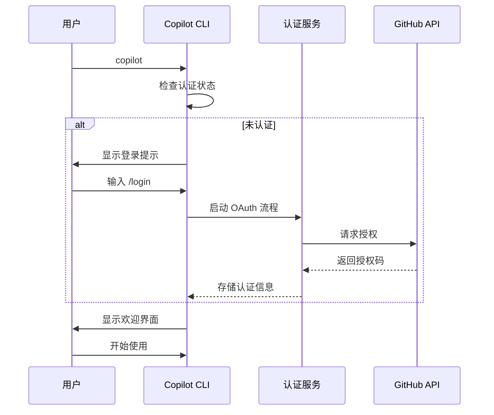
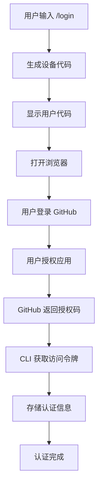
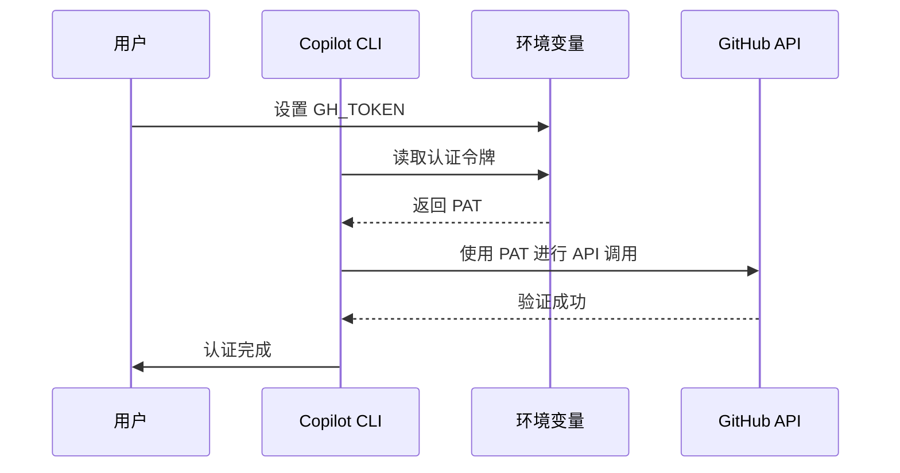
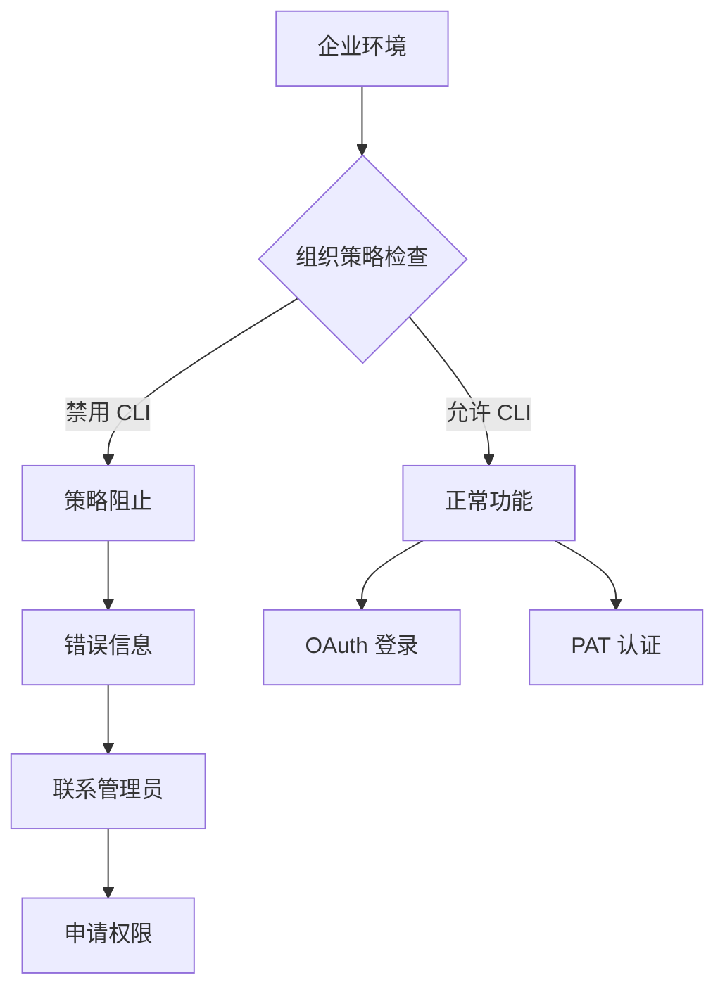

# 安装与配置

<cite>
**本文档中引用的文件**
- [README.md](file://README.md)
- [LICENSE.md](file://LICENSE.md)
- [changelog.md](file://changelog.md)
</cite>

## 目录
1. [简介](#简介)
2. [系统要求](#系统要求)
3. [支持的平台](#支持的平台)
4. [前置条件](#前置条件)
5. [安装步骤](#安装步骤)
6. [启动方法](#启动方法)
7. [认证配置](#认证配置)
8. [环境变量配置](#环境变量配置)
9. [企业环境配置](#企业环境配置)
10. [常见问题解决](#常见问题解决)
11. [最佳实践建议](#最佳实践建议)

## 简介

GitHub Copilot CLI 是一个强大的终端原生开发工具，为开发者提供了人工智能驱动的编码协助功能。通过直接在命令行界面中集成 GitHub Copilot 的智能助手，开发者可以在不切换上下文的情况下进行本地开发工作。

该工具具有以下核心特性：
- 终端原生开发体验，无需上下文切换
- 与 GitHub 工作流深度集成
- 智能代理能力，支持构建、编辑、调试和重构代码
- 基于 MCP 的可扩展架构
- 完全控制权，所有操作都需要明确确认

## 系统要求

### 支持的操作系统

GitHub Copilot CLI 支持以下操作系统平台：

- **Linux** - 完全支持
- **macOS** - 完全支持  
- **Windows** - 实验性支持（已显著改进）

### 版本兼容性



**图表来源**
- [README.md](file://README.md#L25-L35)

## 前置条件

### 必需软件组件

在安装 GitHub Copilot CLI 之前，请确保您的系统满足以下前置条件：

#### 1. Node.js 环境
- **版本要求**: Node.js v22 或更高版本
- **用途**: JavaScript 运行时环境，提供核心执行能力
- **验证方法**: `node --version`

#### 2. npm 包管理器
- **版本要求**: npm v10 或更高版本
- **用途**: 包依赖管理和安装
- **验证方法**: `npm --version`

#### 3. Windows 特殊要求
- **PowerShell 版本**: PowerShell v6 或更高版本
- **用途**: Windows 平台的脚本执行和系统集成
- **验证方法**: `pwsh --version` 或 `powershell --version`

### GitHub Copilot 订阅要求

- **个人订阅**: 需要有效的 GitHub Copilot 个人订阅
- **组织订阅**: 如果您通过组织获得 Copilot 访问权限，则需要组织管理员未禁用 CLI 功能
- **权限检查**: 确保您的账户具有 Copilot 请求权限

**节来源**
- [README.md](file://README.md#L25-L35)

## 安装步骤

### 全局 npm 安装

GitHub Copilot CLI 提供最简单的安装方式，通过 npm 全局安装：

```bash
npm install -g @github/copilot
```

#### 安装过程说明



#### 验证安装

安装完成后，可以通过以下命令验证安装是否成功：

```bash
copilot --version
```

这将显示当前安装的 Copilot CLI 版本号。

### 升级现有安装

如果已经安装了旧版本，可以使用以下命令升级：

```bash
npm update -g @github/copilot
```

**节来源**
- [README.md](file://README.md#L37-L40)

## 启动方法

### 基本启动

首次启动 Copilot CLI 时，系统会显示可爱的动画横幅：

```bash
copilot
```

#### 启动流程



#### 启动参数

CLI 支持多种启动参数来定制行为：

| 参数 | 描述 | 使用场景 |
|------|------|----------|
| `--banner` | 强制显示启动横幅 | 首次使用或重新展示介绍 |
| `--resume` | 恢复最近的会话 | 继续之前的对话 |
| `--continue` | 恢复上一次关闭的会话 | 快速恢复工作 |
| `--screen-reader` | 屏幕阅读器模式 | 辅助功能支持 |

### 会话管理

#### 恢复会话

```bash
copilot --resume
```

此命令列出所有可用的会话历史，允许用户选择恢复特定会话。

#### 新建会话

```bash
copilot --continue
```

快速恢复最近关闭的会话，无需选择界面。

**节来源**
- [README.md](file://README.md#L42-L50)

## 认证配置

### OAuth 登录流程

GitHub Copilot CLI 主要通过 OAuth 2.0 协议进行身份认证：

#### 登录步骤

1. **启动登录流程**：
   ```bash
   copilot
   ```
   如果未认证，系统会提示输入 `/login` 命令。

2. **执行登录命令**：
   ```bash
   /login
   ```

3. **浏览器授权**：
   - 系统会自动打开默认浏览器
   - 在 GitHub 页面上确认授权请求
   - 授权后返回 CLI

4. **认证完成**：
   - 系统存储认证令牌
   - 可以访问 GitHub 仓库、问题和拉取请求

#### OAuth 流程图



### 个人访问令牌（PAT）配置

对于某些环境或自动化场景，可以使用个人访问令牌进行认证：

#### 创建 PAT 步骤

1. **访问设置页面**：
   打开 https://github.com/settings/personal-access-tokens/new

2. **配置权限**：
   - 点击 "添加权限" -> 选择 "Copilot Requests"
   - 设置适当的过期时间

3. **生成令牌**：
   - 点击 "生成令牌"
   - 复制生成的令牌值

#### 环境变量配置

支持两种环境变量名称，按优先级顺序：

| 环境变量名 | 优先级 | 描述 |
|------------|--------|------|
| `GH_TOKEN` | 1（高） | 推荐使用的环境变量 |
| `GITHUB_TOKEN` | 2（低） | 兼容性选项 |

##### Linux/macOS 设置

```bash
# 临时设置（当前终端会话）
export GH_TOKEN="your-personal-access-token"

# 永久设置（添加到 shell 配置文件）
echo 'export GH_TOKEN="your-personal-access-token"' >> ~/.bashrc
source ~/.bashrc
```

##### Windows 设置

```powershell
# 临时设置
$env:GH_TOKEN = "your-personal-access-token"

# 永久设置（PowerShell 配置文件）
Add-Content -Path $PROFILE -Value "`n`$env:GH_TOKEN = 'your-personal-access-token'"
```

#### PAT 认证流程



**节来源**
- [README.md](file://README.md#L52-L65)

## 环境变量配置

### 核心环境变量

GitHub Copilot CLI 支持多个环境变量来自定义行为：

#### GH_HOST

用于配置自定义 GitHub Enterprise 实例：

```bash
export GH_HOST="https://github.yourcompany.com"
```

- **用途**: 指定企业 GitHub 实例的主机地址
- **格式**: 完整的 URL 地址（包含协议）
- **适用场景**: 企业内部部署的 GitHub Enterprise

#### COPILOT_KITTY

启用 Kitty 协议支持，改善多行输入体验：

```bash
export COPILOT_KITTY=1
```

- **用途**: 启用 Kitty 键盘协议支持
- **效果**: 支持 Shift+Ctrl 组合键进行多行输入
- **适用终端**: 支持 Kitty 协议的终端模拟器

### 高级配置选项

#### 日志级别配置

通过配置文件设置日志级别：

```bash
# 在 ~/.copilot/config 中设置
{
  "log_level": "debug"
}
```

可用的日志级别：
- `none`: 禁用日志
- `error`: 仅错误信息
- `warning`: 警告和错误
- `info`: 基础信息
- `debug`: 调试信息
- `all`: 所有信息

#### MCP 服务器配置

```bash
# 添加额外的 MCP 服务器配置
export GH_TOKEN="your-token"
export COPILOT_KITTY=1
export GH_HOST="https://github.enterprise.com"
```

**节来源**
- [changelog.md](file://changelog.md#L150-L160)

## 企业环境配置

### 策略限制问题

在企业环境中使用 GitHub Copilot CLI 时，可能会遇到以下策略限制：

#### 组织策略



#### 常见限制类型

1. **CLI 功能禁用**
   - 组织管理员可以在 GitHub 设置中完全禁用 Copilot CLI
   - 检查路径：`Organization Settings > Copilot > Copilot CLI`

2. **网络访问限制**
   - 企业防火墙可能阻止对 GitHub API 的访问
   - 需要配置代理设置

3. **认证策略**
   - 可能强制使用 SAML SSO
   - 需要确保 CLI 支持的企业身份提供商

### 解决方案

#### 联系管理员

当遇到策略限制时，建议联系企业管理员：

```bash
# 检查当前认证状态
copilot --debug

# 收集诊断信息
copilot --help
```

#### 代理配置

对于网络受限环境，配置代理：

```bash
# HTTP 代理
export HTTP_PROXY="http://proxy.company.com:8080"
export HTTPS_PROXY="http://proxy.company.com:8080"

# 企业证书
export NODE_EXTRA_CA_CERTS="/path/to/corporate-ca.pem"
```

#### 本地部署考虑

企业可能需要考虑：
- GitHub Enterprise Server vs GitHub Enterprise Cloud
- 自定义 MCP 服务器配置
- 本地工具集成

**节来源**
- [README.md](file://README.md#L32-L35)

## 常见问题解决

### 安装相关问题

#### 1. npm 权限错误

**问题症状**：
```
Error: EACCES: permission denied
```

**解决方案**：
```bash
# 方法1：使用 sudo（不推荐）
sudo npm install -g @github/copilot

# 方法2：修复 npm 全局目录权限（推荐）
mkdir ~/.npm-global
npm config set prefix '~/.npm-global'
export PATH=~/.npm-global/bin:$PATH
source ~/.bashrc
```

#### 2. Node.js 版本不兼容

**问题症状**：
```
Error: This version of Node.js is not supported
```

**解决方案**：
```bash
# 检查当前版本
node --version

# 升级到 Node.js v22+
# 使用 nvm（推荐）
nvm install 22
nvm use 22
```

### 认证相关问题

#### 1. OAuth 登录失败

**问题症状**：
- 浏览器无法打开或授权失败
- 出现 "Unable to open browser" 错误

**解决方案**：
```bash
# 使用 PAT 替代 OAuth
export GH_TOKEN="your-personal-access-token"
copilot
```

#### 2. PAT 权限不足

**问题症状**：
```
Error: The personal access token does not have the required "Copilot Requests" permission
```

**解决方案**：
1. 检查 PAT 权限设置
2. 确保启用了 "Copilot Requests" 权限
3. 重新生成并更新环境变量

### 运行时问题

#### 1. 内存不足

**问题症状**：
```
FATAL ERROR: Ineffective mark-compacts near heap limit
```

**解决方案**：
```bash
# 增加 Node.js 内存限制
export NODE_OPTIONS="--max-old-space-size=4096"
copilot
```

#### 2. 文件权限问题

**问题症状**：
```
Error: EACCES: permission denied
```

**解决方案**：
```bash
# 检查文件夹权限
ls -la ~/.copilot/

# 修复权限
chmod -R 755 ~/.copilot/
```

### 性能优化

#### 1. 启动速度慢

**优化方法**：
```bash
# 禁用不必要的功能
copilot --disable-parallel-tools-execution

# 使用更小的模型
copilot --model claude-sonnet-4
```

#### 2. 网络连接问题

**诊断命令**：
```bash
# 测试网络连接
curl -I https://api.github.com

# 检查 DNS 解析
nslookup api.github.com
```

**节来源**
- [changelog.md](file://changelog.md#L200-L250)

## 最佳实践建议

### 安装最佳实践

#### 1. 版本管理

```bash
# 检查最新版本
npm show @github/copilot version

# 安装特定版本（生产环境）
npm install -g @github/copilot@0.0.353

# 查看已安装版本
copilot --version
```

#### 2. 环境隔离

```bash
# 使用 nvm 管理 Node.js 版本
nvm install 22
nvm use 22

# 为不同项目创建独立环境
mkdir ~/copilot-env && cd ~/copilot-env
npm init -y
npm install @github/copilot
```

### 认证最佳实践

#### 1. 安全存储

```bash
# 使用密钥管理器
security add-generic-password -a copilot -s github-token -w $GH_TOKEN

# 或者使用 .env 文件（本地开发）
echo "GH_TOKEN=your-token" > .env
echo ".env" >> .gitignore
```

#### 2. 定期轮换

```bash
# 设置自动轮换提醒
echo "Remember to rotate your GitHub token monthly" >> ~/.bash_profile

# 检查令牌有效期
copilot --debug | grep -i token
```

### 配置最佳实践

#### 1. 环境变量管理

```bash
# 创建配置文件
cat << EOF > ~/.copilot-config.sh
#!/bin/bash
# GitHub Copilot CLI 配置
export GH_HOST="https://github.com"
export COPILOT_KITTY=1
export LOG_LEVEL="info"
EOF

# 加载配置
source ~/.copilot-config.sh
```

#### 2. 会话管理

```bash
# 创建会话别名
alias cpl='copilot --resume'

# 自动保存会话
copilot --continue &
```

### 企业环境最佳实践

#### 1. 策略合规

```bash
# 检查企业策略
copilot --help | grep -i policy

# 验证网络连通性
copilot --debug | grep -i network
```

#### 2. 监控和维护

```bash
# 定期检查更新
npm outdated @github/copilot

# 监控使用情况
copilot --usage

# 清理缓存
rm -rf ~/.copilot/cache/*
```

### 故障排除清单

#### 启动前检查

- [ ] Node.js 版本 ≥ v22
- [ ] npm 版本 ≥ v10
- [ ] PowerShell 版本 ≥ v6（Windows）
- [ ] GitHub Copilot 订阅有效
- [ ] 网络连接正常
- [ ] 环境变量配置正确

#### 运行时监控

- [ ] 内存使用率 < 80%
- [ ] 磁盘空间充足
- [ ] 网络连接稳定
- [ ] 认证状态有效

通过遵循这些最佳实践，您可以确保 GitHub Copilot CLI 在各种环境中稳定可靠地运行，为您的开发工作提供最大的价值。

**节来源**
- [README.md](file://README.md#L70-L84)
- [changelog.md](file://changelog.md#L1-L50)