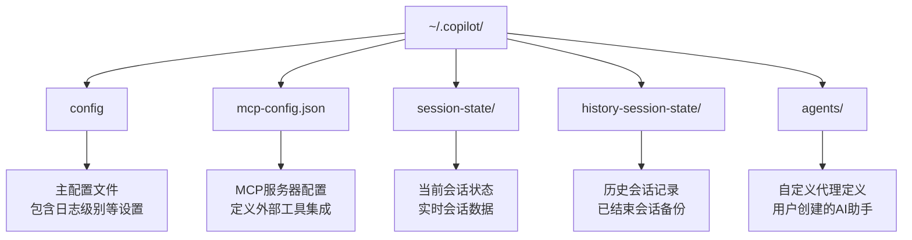
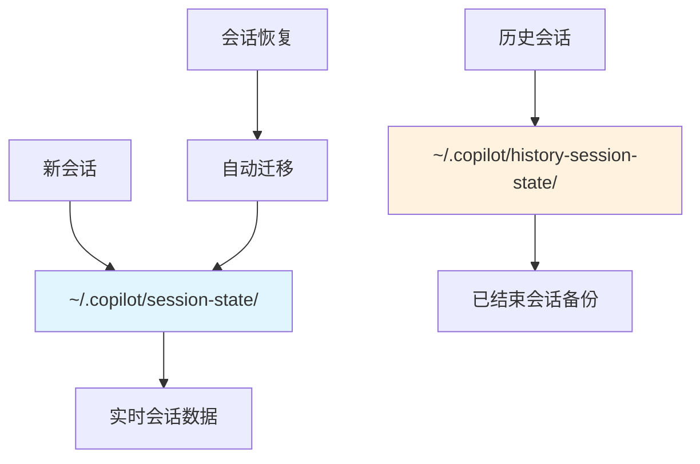
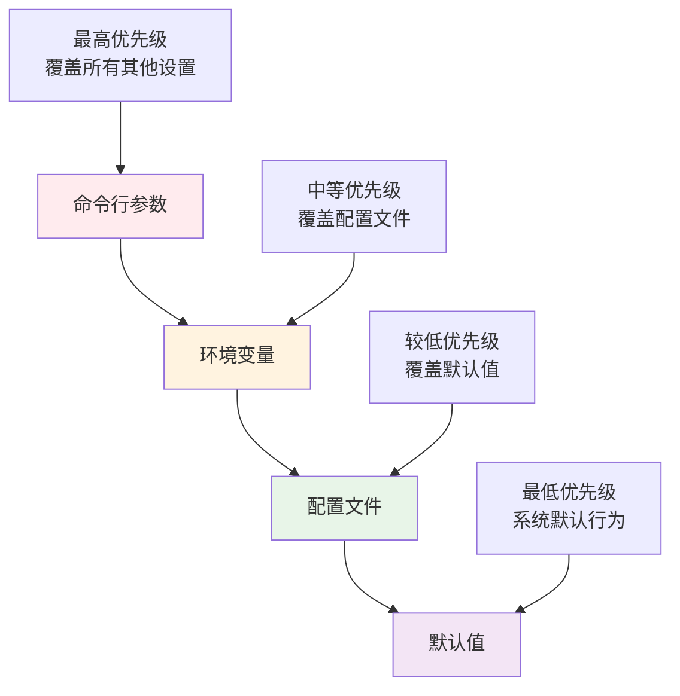
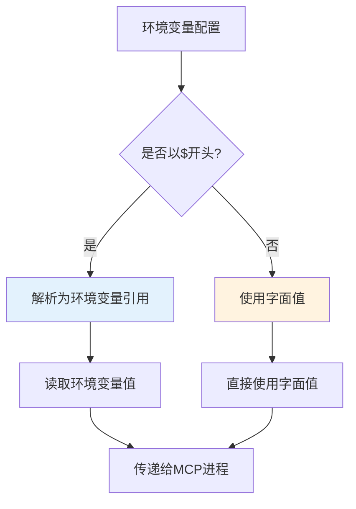

# 配置与环境

<cite>
**本文档中引用的文件**
- [README.md](file://README.md)
- [changelog.md](file://changelog.md)
</cite>

## 目录
1. [简介](#简介)
2. [配置文件位置与结构](#配置文件位置与结构)
3. [核心配置文件详解](#核心配置文件详解)
4. [环境变量配置](#环境变量配置)
5. [配置优先级规则](#配置优先级规则)
6. [MCP服务器配置](#mcp服务器配置)
7. [配置迁移指南](#配置迁移指南)
8. [配置验证与故障排除](#配置验证与故障排除)
9. [最佳实践建议](#最佳实践建议)

## 简介

GitHub Copilot CLI提供了灵活的配置系统，支持多种配置方式来满足不同使用场景的需求。通过配置文件、环境变量和命令行参数的组合，用户可以完全控制CLI的行为，包括日志级别、模型选择、MCP服务器配置等关键功能。

## 配置文件位置与结构

### 标准配置目录

GitHub Copilot CLI使用以下标准配置目录结构：



**图表来源**
- [changelog.md](file://changelog.md#L120-L132)

### 配置文件类型

| 文件名 | 类型 | 用途 | 默认位置 |
|--------|------|------|----------|
| `config` | 主配置文件 | 日志级别、调试设置 | `~/.copilot/config` |
| `mcp-config.json` | MCP配置文件 | 外部工具服务器配置 | `~/.copilot/mcp-config.json` |
| `session-state/` | 会话目录 | 当前活跃会话数据 | `~/.copilot/session-state/` |
| `history-session-state/` | 历史目录 | 已结束会话备份 | `~/.copilot/history-session-state/` |
| `agents/` | 代理目录 | 自定义AI助手定义 | `~/.copilot/agents/` |

**节来源**
- [changelog.md](file://changelog.md#L120-L132)

## 核心配置文件详解

### 主配置文件 (~/.copilot/config)

主配置文件支持持久化的配置设置，主要包括日志级别和其他全局选项。

#### 日志级别配置

| 级别 | 描述 | 用途 |
|------|------|------|
| `none` | 完全禁用日志 | 生产环境部署 |
| `error` | 仅错误信息 | 故障排查 |
| `warning` | 警告和错误 | 一般使用 |
| `info` | 基础信息和警告 | 开发调试 |
| `debug` | 详细调试信息 | 深度问题诊断 |
| `all` | 所有日志信息 | 最详细的调试 |
| `default` | 默认级别 | 系统默认行为 |

#### 配置示例

```json
{
    "log_level": "info",
    "debug": false,
    "banner": true
}
```

**节来源**
- [changelog.md](file://changelog.md#L127-L132)

### 会话状态管理

CLI维护两种会话状态存储格式：



**图表来源**
- [changelog.md](file://changelog.md#L120-L132)

## 环境变量配置

### 认证相关环境变量

| 变量名 | 优先级 | 描述 | 示例值 |
|--------|--------|------|--------|
| `GH_TOKEN` | 高 | GitHub个人访问令牌 | `ghp_xxxxxxxxxxxx` |
| `GITHUB_TOKEN` | 中 | GitHub令牌备用选项 | `ghp_xxxxxxxxxxxx` |
| `GH_HOST` | 中 | 自定义GitHub企业主机 | `github.company.com` |

### 代理配置环境变量

| 变量名 | 描述 | 使用场景 |
|--------|------|----------|
| `HTTPS_PROXY` | HTTPS代理服务器地址 | HTTPS流量代理 |
| `HTTP_PROXY` | HTTP代理服务器地址 | HTTP流量代理 |

### 终端特性环境变量

| 变量名 | 功能 | 支持平台 |
|--------|------|----------|
| `COPILOT_KITTY` | 启用Kitty协议支持 | 所有平台 |
| `COPILOT_SCREEN_READER` | 屏幕阅读器模式 | 所有平台 |

### 环境变量使用示例

```bash
# 设置GitHub认证令牌
export GH_TOKEN="ghp_xxxxxxxxxxxx"

# 配置代理服务器
export HTTPS_PROXY="http://proxy.company.com:8080"
export HTTP_PROXY="http://proxy.company.com:8080"

# 启用Kitty协议支持
export COPILOT_KITTY=1

# 屏幕阅读器模式
export COPILOT_SCREEN_READER=1
```

**节来源**
- [README.md](file://README.md#L63)
- [changelog.md](file://changelog.md#L127-L132)
- [changelog.md](file://changelog.md#L173-L179)
- [changelog.md](file://changelog.md#L191)

## 配置优先级规则

### 优先级顺序（从高到低）



### 具体覆盖规则

1. **命令行参数**：最高优先级，直接在命令行中指定的参数
2. **环境变量**：中等优先级，通过环境变量设置的配置
3. **配置文件**：较低优先级，持久化保存的配置设置
4. **默认值**：最低优先级，系统内置的默认配置

### 实际应用示例

```bash
# 命令行参数覆盖配置文件中的设置
copilot --log-level debug --model claude-sonnet

# 环境变量覆盖配置文件
export COPILOT_LOG_LEVEL=warning
copilot  # 使用环境变量设置的日志级别

# 配置文件设置（持久化）
echo '{"log_level": "info"}' > ~/.copilot/config
```

## MCP服务器配置

### MCP配置文件结构

MCP（Model Context Protocol）服务器配置允许集成外部工具和服务。

#### 基本配置结构

```json
{
    "mcpServers": {
        "server-name": {
            "command": "/path/to/server",
            "args": ["arg1", "arg2"],
            "env": {
                "ENV_VAR_NAME": "${ENV_VAR_VALUE}"
            }
        }
    }
}
```

#### 环境变量处理规则



**图表来源**
- [changelog.md](file://changelog.md#L143-L158)

### MCP服务器配置示例

```json
{
    "mcpServers": {
        "github": {
            "command": "copilot-github-server",
            "args": ["--port", "8080"],
            "env": {
                "GITHUB_ACCESS_TOKEN": "${GITHUB_TOKEN}",
                "GITHUB_API_URL": "${GH_HOST}/api/v3"
            }
        },
        "custom-tool": {
            "command": "/usr/local/bin/custom-tool",
            "args": ["--config", "/etc/custom-tool/config.json"],
            "env": {
                "CUSTOM_API_KEY": "${CUSTOM_API_KEY}",
                "LOG_LEVEL": "info"
            }
        }
    }
}
```

**节来源**
- [changelog.md](file://changelog.md#L98-L117)

## 配置迁移指南

### MCP配置文件语法变更

#### 版本差异对比

| 配置项 | 旧版本语法 | 新版本语法 | 迁移方法 |
|--------|------------|------------|----------|
| 环境变量引用 | `"VAR_NAME": "VALUE"` | `"VAR_NAME": "${VALUE}"` | 添加`$`前缀 |
| 字面值 | `"VAR_NAME": "literal"` | `"VAR_NAME": "literal"` | 保持不变 |

#### 迁移示例

**旧版本配置：**
```json
{
    "env": {
        "GITHUB_ACCESS_TOKEN": "GITHUB_TOKEN",
        "API_ENDPOINT": "https://api.example.com"
    }
}
```

**新版本配置：**
```json
{
    "env": {
        "GITHUB_ACCESS_TOKEN": "${GITHUB_TOKEN}",
        "API_ENDPOINT": "https://api.example.com"
    }
}
```

### 迁移步骤

1. **备份现有配置**
   ```bash
   cp ~/.copilot/mcp-config.json ~/.copilot/mcp-config.json.backup
   ```

2. **识别需要更新的环境变量**
   - 查找`env`字段中的字符串值
   - 确认哪些值应该作为环境变量引用

3. **执行语法转换**
   ```bash
   sed -i 's/"\([^"]*\)": "\(.*\)"/"\1": "${\2}"/g' ~/.copilot/mcp-config.json
   ```

4. **验证配置**
   ```bash
   copilot --additional-mcp-config @~/.copilot/mcp-config.json --help
   ```

5. **测试MCP服务器连接**
   ```bash
   copilot --additional-mcp-config @~/.copilot/mcp-config.json --mcp list
   ```

**节来源**
- [changelog.md](file://changelog.md#L143-L158)

## 配置验证与故障排除

### 常见配置问题

#### 1. MCP服务器连接失败

**症状：**
- `Failed to connect to MCP server`
- `Server not responding`

**解决方案：**
```bash
# 检查MCP配置文件语法
copilot --additional-mcp-config @~/.copilot/mcp-config.json --help

# 测试服务器可访问性
curl -I http://localhost:8080

# 启用调试日志
export COPILOT_LOG_LEVEL=debug
copilot --additional-mcp-config @~/.copilot/mcp-config.json
```

#### 2. 环境变量未正确解析

**症状：**
- 空的或错误的环境变量值
- `Environment variable not found` 错误

**解决方案：**
```bash
# 检查环境变量是否存在
echo $GITHUB_TOKEN

# 验证配置文件语法
cat ~/.copilot/mcp-config.json | jq .

# 使用绝对路径而非相对路径
"command": "/usr/local/bin/server"
```

#### 3. 权限问题

**症状：**
- `Permission denied` 错误
- 无法访问某些文件或目录

**解决方案：**
```bash
# 检查文件权限
ls -la ~/.copilot/

# 修复权限问题
chmod 700 ~/.copilot/
chmod 600 ~/.copilot/config
chmod 600 ~/.copilot/mcp-config.json
```

### 调试配置问题

#### 启用详细日志

```bash
# 设置最高日志级别
export COPILOT_LOG_LEVEL=all

# 启用调试输出
copilot --debug

# 查看配置加载过程
copilot --help config
```

#### 配置验证命令

```bash
# 验证配置文件语法
copilot --help config

# 测试配置加载
copilot --dry-run

# 检查环境变量设置
copilot --print-config
```

### 性能优化配置

#### 内存使用优化

```json
{
    "log_level": "warning",
    "max_context_tokens": 4000,
    "stream_output": true
}
```

#### 网络性能优化

```bash
# 配置代理以提高网络性能
export HTTPS_PROXY=http://proxy.company.com:8080

# 启用连接池
export NODE_OPTIONS="--max-http-header-size=8192"
```

## 最佳实践建议

### 安全配置

1. **保护敏感信息**
   - 不要在配置文件中硬编码敏感信息
   - 使用环境变量存储密钥
   - 定期轮换认证令牌

2. **最小权限原则**
   - 为MCP服务器配置最小必要的权限
   - 使用专用的服务账户
   - 定期审查权限设置

### 性能配置

1. **合理设置日志级别**
   ```bash
   # 生产环境：使用warning级别
   export COPILOT_LOG_LEVEL=warning
   
   # 开发环境：使用info级别
   export COPILOT_LOG_LEVEL=info
   ```

2. **优化内存使用**
   ```json
   {
       "max_context_tokens": 8000,
       "stream_output": true,
       "enable_parallel_tools": false
   }
   ```

### 维护建议

1. **定期备份配置**
   ```bash
   # 创建配置备份
   tar -czf ~/copilot-config-backup.tar.gz ~/.copilot/
   
   # 定期检查配置文件
   ls -la ~/.copilot/
   ```

2. **监控配置变更**
   ```bash
   # 监控配置文件修改
   inotifywait -m ~/.copilot/
   
   # 检查配置文件完整性
   sha256sum ~/.copilot/config
   ```

3. **版本控制配置**
   ```bash
   # 将配置文件添加到版本控制
   git init ~/.copilot/
   cd ~/.copilot/
   git add .
   git commit -m "Initial configuration"
   ```

通过遵循这些最佳实践，您可以确保GitHub Copilot CLI的配置既安全又高效，同时便于维护和故障排除。