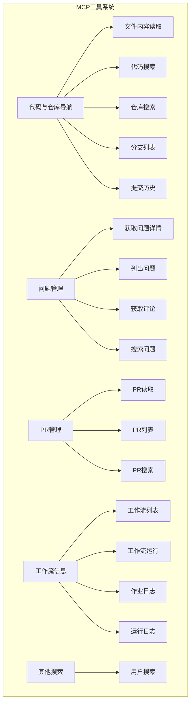
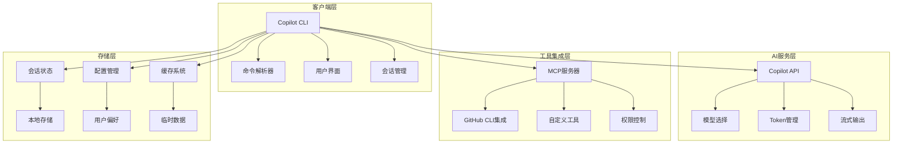
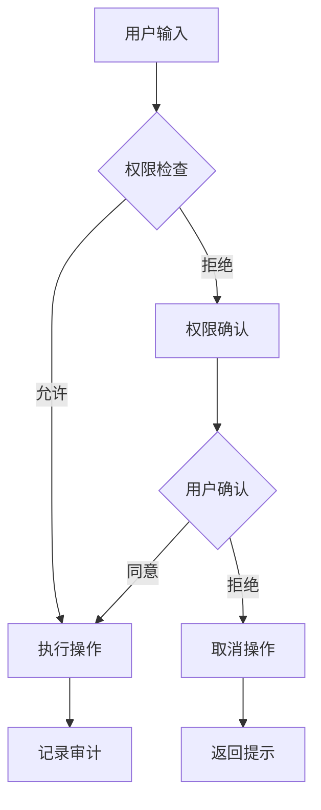
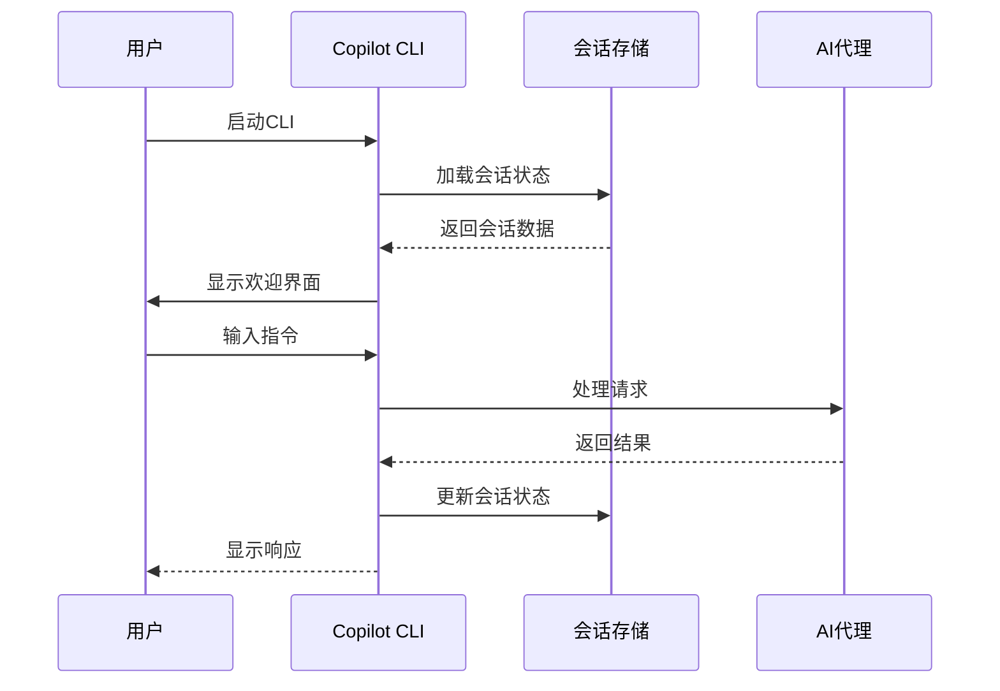
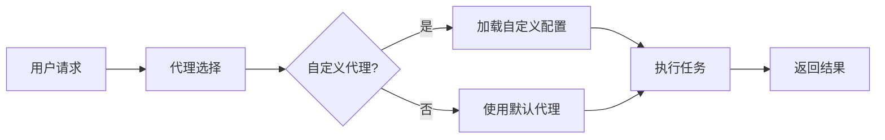

# 项目概述

<cite>
**本文档中引用的文件**
- [README.md](file://README.md)
- [changelog.md](file://changelog.md)
- [LICENSE.md](file://LICENSE.md)
</cite>

## 目录
1. [项目简介](#项目简介)
2. [核心目标与设计理念](#核心目标与设计理念)
3. [主要功能特性](#主要功能特性)
4. [目标用户群体](#目标用户群体)
5. [技术架构概览](#技术架构概览)
6. [平台支持与环境要求](#平台支持与环境要求)
7. [核心组件分析](#核心组件分析)
8. [使用场景与应用案例](#使用场景与应用案例)
9. [项目优势与差异化](#项目优势与差异化)
10. [项目状态与发展前景](#项目状态与发展前景)

## 项目简介

GitHub Copilot CLI是GitHub推出的一款革命性终端命令行工具，将强大的AI编程辅助能力直接带入开发者熟悉的命令行环境中。作为GitHub Copilot生态系统的重要组成部分，该CLI工具通过自然语言交互的方式，为开发者提供智能的代码生成、编辑、调试和理解能力，同时深度集成了GitHub的工作流程。

该项目目前处于**公共预览版**阶段，标志着GitHub在AI驱动开发体验方面的重大突破。通过将Copilot的智能代理能力与终端环境无缝结合，开发者可以在不离开命令行的情况下获得AI辅助的编程体验。

**节来源**
- [README.md](file://README.md#L1-L18)

## 核心目标与设计理念

### 设计理念

GitHub Copilot CLI的设计遵循以下核心理念：

1. **终端原生开发**：完全在命令行环境中运行，无需上下文切换，保持开发者的专注度
2. **深度GitHub集成**：与GitHub工作流程天然契合，支持仓库、问题和拉取请求的自然语言访问
3. **智能代理协作**：提供能够规划和执行复杂任务的AI合作者
4. **可扩展性**：基于MCP（Model Context Protocol）系统，支持自定义扩展
5. **完全控制**：每个操作都经过显式确认，确保用户对AI行为的完全掌控

### 核心目标

- **提升开发效率**：通过AI辅助减少重复性编码任务，加速开发周期
- **改善代码质量**：提供智能建议和最佳实践指导
- **降低学习成本**：通过自然语言交互，让AI编程助手更易于使用
- **增强协作能力**：支持团队在GitHub生态系统中的协同开发

**节来源**
- [README.md](file://README.md#L10-L18)

## 主要功能特性

### 自然语言交互

GitHub Copilot CLI最显著的特点是其自然语言交互能力。用户可以通过简单的文本描述来完成复杂的编程任务，无需记忆特定的命令或语法。

### 代码生成与编辑

- **智能代码补全**：基于上下文提供准确的代码建议
- **函数重构**：自动优化现有代码结构
- **错误修复**：识别并修复常见的编程错误
- **性能优化**：提供代码性能改进建议

### 文件操作能力

- **文件内容读取**：安全地访问和查看项目文件
- **批量文件操作**：支持多个文件的同时处理
- **路径权限管理**：智能的文件系统权限控制

### Git操作集成

- **分支管理**：创建、切换和合并Git分支
- **提交操作**：自动生成有意义的提交消息
- **版本控制**：完整的Git工作流支持

### 拉取请求管理

- **PR创建**：自动生成高质量的拉取请求
- **代码审查**：提供智能的代码审查建议
- **冲突解决**：协助解决合并冲突

### MCP工具系统

GitHub Copilot CLI内置了强大的MCP（Model Context Protocol）服务器，提供以下核心功能：

**图表来源**
- [changelog.md](file://changelog.md#L20-L51)

### 权限控制系统

系统实现了精细的权限控制机制：

- **路径权限检测**：智能识别只读和写入操作
- **命令白名单**：支持通配符匹配的shell命令规则
- **实时权限确认**：每次敏感操作前都需要用户确认

**节来源**
- [README.md](file://README.md#L10-L18)
- [changelog.md](file://changelog.md#L20-L51)

## 目标用户群体

### 开发者

- **初级开发者**：需要学习最佳实践和编程技巧
- **中级开发者**：希望提高编码效率和代码质量
- **高级开发者**：寻求快速原型开发和复杂问题解决

### 团队负责人

- **技术主管**：需要监控团队开发质量和效率
- **架构师**：需要评估和优化系统设计
- **项目经理**：需要跟踪项目进度和资源分配

### 技术决策者

- **CTO/VP Engineering**：需要评估新技术和工具的投资价值
- **技术顾问**：需要为客户提供技术解决方案建议
- **开源贡献者**：需要参与大型开源项目开发

## 技术架构概览

### 基于Node.js的CLI架构

GitHub Copilot CLI采用现代的Node.js技术栈构建：

### 与GitHub CLI的深度集成

系统与GitHub CLI（gh）紧密集成，提供统一的GitHub访问体验：

- **认证共享**：使用相同的GitHub凭据
- **命令兼容**：支持标准的GitHub CLI命令
- **上下文同步**：自动识别当前仓库和分支

### MCP工具系统

MCP（Model Context Protocol）是系统的核心扩展机制：

- **默认工具集**：包含所有必要的GitHub操作工具
- **自定义扩展**：支持第三方工具和服务
- **动态加载**：按需加载和卸载工具

### 权限控制系统

实现多层次的安全防护：

**节来源**
- [changelog.md](file://changelog.md#L20-L51)

## 平台支持与环境要求

### 支持的操作系统

GitHub Copilot CLI支持以下平台：

- **Linux**：广泛的Linux发行版兼容性
- **macOS**：最新版本的macOS系统支持
- **Windows**：Windows 10及更高版本

### 环境要求

- **Node.js**：v22或更高版本
- **npm**：v10或更高版本
- **PowerShell**（仅Windows）：v6或更高版本

### 认证要求

- **活跃的Copilot订阅**：个人或企业订阅均可
- **GitHub账户**：支持OAuth和Personal Access Token认证
- **组织策略**：企业用户需确保组织管理员未禁用该功能

**节来源**
- [README.md](file://README.md#L22-L39)

## 核心组件分析

### 会话管理系统

系统实现了先进的会话管理机制：

**图表来源**
- [changelog.md](file://changelog.md#L120-L132)

### 工具调用机制

系统支持多种类型的工具调用：

- **同步工具调用**：立即执行并等待结果
- **异步工具调用**：后台执行，支持委托模式
- **并行工具调用**：多个工具同时执行（可配置）

### 流式输出处理

实现了高效的流式输出机制：

- **令牌级流式传输**：逐个令牌输出，提升响应速度
- **内存优化**：处理大型输出时的内存管理
- **中断处理**：优雅地处理用户中断操作

**节来源**
- [changelog.md](file://changelog.md#L53-L70)
- [changelog.md](file://changelog.md#L120-L132)

## 使用场景与应用案例

### 日常开发辅助

**代码生成场景**：
- 快速生成常见代码模板
- 自动生成单元测试框架
- 创建API端点和路由

**调试辅助**：
- 分析错误堆栈跟踪
- 提供修复建议
- 性能瓶颈识别

### 代码审查场景

**自动化审查**：
- 静态代码分析
- 安全漏洞检测
- 代码风格一致性检查

**团队协作**：
- 协作式代码审查
- 知识分享和培训
- 质量标准制定

### 自动化任务处理

**CI/CD集成**：
- 自动化部署脚本生成
- 构建配置优化
- 监控和告警设置

**运维任务**：
- 系统配置管理
- 数据库迁移脚本
- 容器编排文件

### 特殊功能演示

#### 自定义代理支持

**图表来源**
- [changelog.md](file://changelog.md#L0-L18)

#### 异步任务委托

系统支持将复杂任务委托给AI代理后台执行：

- **自动分支创建**：基于变更自动生成新分支
- **PR自动创建**：完成工作后自动打开拉取请求
- **持续监控**：跟踪任务执行状态

**节来源**
- [changelog.md](file://changelog.md#L0-L18)

## 项目优势与差异化

### 与传统开发工具的对比

| 特性 | 传统IDE | GitHub Copilot CLI |
|------|---------|-------------------|
| 交互方式 | 图形界面 | 命令行界面 |
| 学习曲线 | 中等 | 较低 |
| 上下文切换 | 需要 | 无需 |
| 集成程度 | 有限 | 深度集成 |
| 扩展能力 | 中等 | 强大 |
| 权限控制 | 简单 | 精细 |

### 与Web界面的差异

- **响应速度**：命令行界面通常更快
- **离线能力**：支持离线使用
- **批量操作**：更适合批量处理任务
- **脚本集成**：更容易集成到自动化脚本

### 技术创新点

1. **多模态输入支持**：支持文本、图像等多种输入形式
2. **智能权限管理**：基于上下文的动态权限控制
3. **流式处理**：实时的输出流式传输
4. **会话持久化**：完整的对话历史保存和恢复

**节来源**
- [README.md](file://README.md#L10-L18)

## 项目状态与发展前景

### 当前状态

GitHub Copilot CLI目前处于**公共预览版**阶段：

- **功能完整性**：核心功能已基本完善
- **稳定性**：经过大量测试验证
- **社区反馈**：积极收集用户意见进行迭代

### 发展路线图

根据最新的变更日志，项目的发展重点包括：

1. **性能优化**：持续改进响应速度和资源使用
2. **功能扩展**：添加新的工具和集成选项
3. **用户体验**：优化界面设计和交互流程
4. **平台支持**：扩大操作系统和终端的支持范围

### 未来发展方向

- **企业级功能**：增强企业管理和合规功能
- **插件生态**：建立丰富的第三方工具生态系统
- **AI能力升级**：集成更先进的AI模型和算法
- **跨平台统一**：实现更一致的跨平台体验

### 社区参与

项目鼓励社区参与和反馈：

- **问题报告**：通过GitHub Issues报告bug
- **功能建议**：提出新功能需求和改进建议
- **代码贡献**：欢迎开源贡献和协作开发
- **文档改进**：帮助完善项目文档和教程

**节来源**
- [README.md](file://README.md#L76-L83)
- [changelog.md](file://changelog.md#L0-L18)

## 结论

GitHub Copilot CLI代表了AI驱动开发工具的新纪元。通过将强大的AI编程辅助能力与传统的命令行环境完美结合，它为开发者提供了一个既高效又灵活的开发工具。随着项目的持续发展和完善，我们有理由相信它将在未来的软件开发实践中发挥越来越重要的作用。

对于正在寻找提升开发效率、改善代码质量、简化团队协作方案的个人开发者和企业团队来说，GitHub Copilot CLI无疑是一个值得重点关注和尝试的创新工具。其公共预览版的状态表明GitHub正在积极听取用户反馈并快速迭代产品，这为用户提供了参与产品发展的宝贵机会。