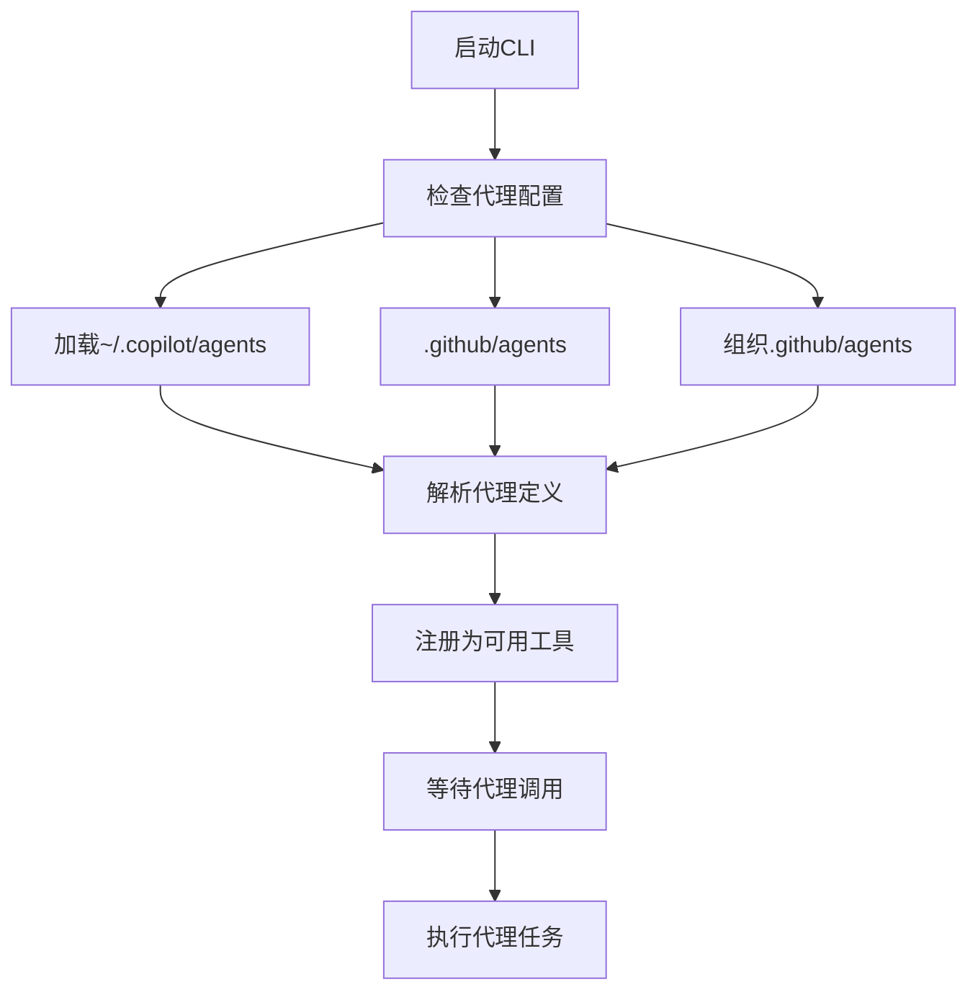
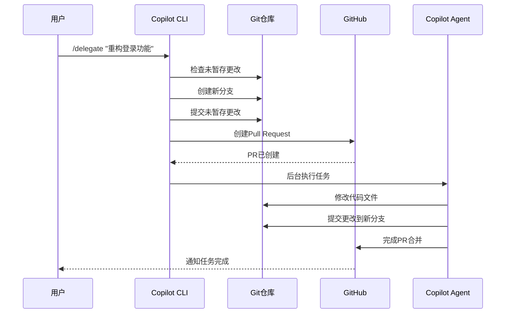
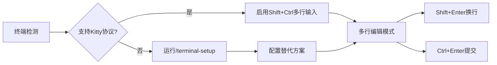
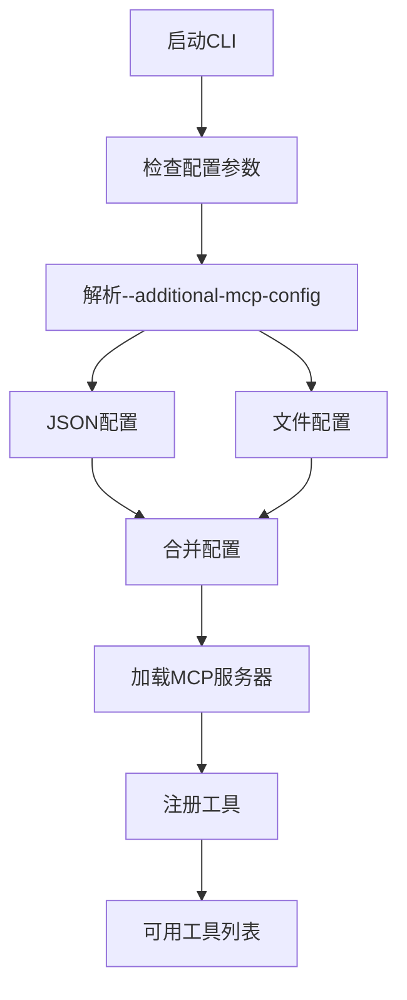
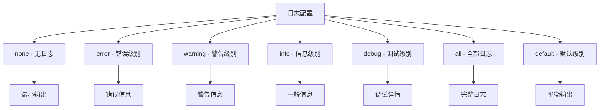
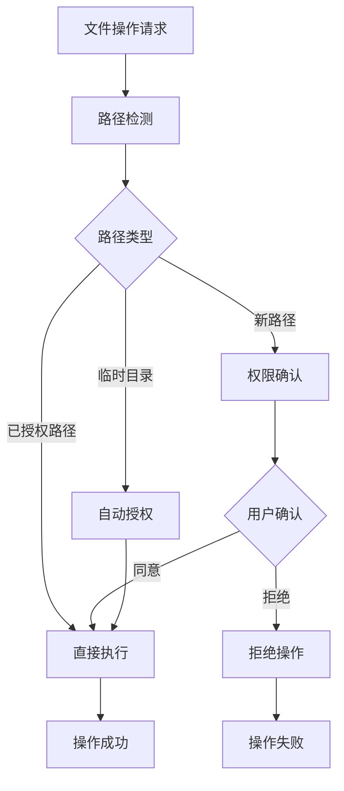

# 高级功能

<cite>
**本文档中引用的文件**
- [README.md](file://README.md)
- [changelog.md](file://changelog.md)
</cite>

## 目录
1. [简介](#简介)
2. [自定义代理系统](#自定义代理系统)
3. [异步任务委托功能](#异步任务委托功能)
4. [多行输入支持](#多行输入支持)
5. [自定义MCP服务器配置](#自定义mcp服务器配置)
6. [调试日志配置](#调试日志配置)
7. [高级权限控制](#高级权限控制)
8. [总结](#总结)

## 简介

GitHub Copilot CLI提供了丰富的高级功能，使开发者能够更高效地与AI协作进行代码开发。这些功能包括自定义代理系统、异步任务委托、多行输入支持、MCP服务器配置以及专业的调试和权限控制选项。

## 自定义代理系统

### 代理定义加载机制

Copilot CLI支持强大的自定义代理系统，允许用户创建和管理专门的AI代理来处理特定任务。



**图表来源**
- [changelog.md](file://changelog.md#L0-L18)

### 代理位置优先级

系统按照以下优先级顺序加载代理定义：

1. **用户本地代理**：`~/.copilot/agents/` - 用户个人定制的代理
2. **仓库代理**：`.github/agents/` - 当前仓库中的代理配置
3. **组织代理**：`your-org/.github/agents/` - 组织级别的共享代理

### 代理调用方式

#### 交互式调用
使用`/agent` slash命令：
```bash
/agent my-custom-agent
```

#### 非交互式调用
通过命令行参数：
```bash
copilot --agent my-custom-agent
```

**章节来源**
- [changelog.md](file://changelog.md#L0-L18)

## 异步任务委托功能

### 委托命令工作流程

`/delegate`命令提供了强大的异步任务处理能力，允许Copilot在后台完成复杂的代码任务。



**图表来源**
- [changelog.md](file://changelog.md#L0-L18)

### 委托功能特性

1. **自动分支管理**：系统自动创建专用分支处理委托任务
2. **智能变更提交**：仅提交相关的未暂存更改
3. **PR自动化**：自动创建Pull Request并跟踪进度
4. **后台执行**：任务在后台持续运行直到完成
5. **状态跟踪**：实时监控任务进度和状态

**章节来源**
- [changelog.md](file://changelog.md#L0-L18)

## 多行输入支持

### Kitty协议支持

Copilot CLI默认启用了Kitty协议支持，提供优秀的多行输入体验。



**图表来源**
- [changelog.md](file://changelog.md#L120-L132)

### 终端设置配置

#### 自动检测
系统会自动检测终端是否支持Kitty协议，并在不支持时提示配置。

#### 手动配置
使用`/terminal-setup`命令进行手动配置：
```bash
/terminal-setup
```

#### 支持的终端
- **VSCode及其衍生版本**：内置支持
- **支持Kitty协议的终端**：需要Shift+Ctrl组合键
- **其他终端**：通过`/terminal-setup`命令配置

### 多行输入特性

1. **无缝换行**：Shift+Enter实现自然换行
2. **智能提交**：Ctrl+Enter快速提交输入
3. **历史导航**：上下箭头浏览输入历史
4. **光标移动**：Ctrl+B/Ctrl+F前后移动光标

**章节来源**
- [changelog.md](file://changelog.md#L120-L132)
- [changelog.md](file://changelog.md#L134-L141)

## 自定义MCP服务器配置

### 配置方法

Copilot CLI提供了灵活的MCP（Model Context Protocol）服务器配置系统，支持临时和永久配置。



**图表来源**
- [changelog.md](file://changelog.md#L98-L117)

### 配置格式

#### 内联JSON配置
```bash
copilot --additional-mcp-config '{"mcpServers": {"my-tool": {"command": "python /path/to/script.py"}}}'
```

#### 文件配置
```bash
copilot --additional-mcp-config @/path/to/config.json
```

#### 多文件配置
```bash
copilot --additional-mcp-config @base.json --additional-mcp-config @overrides.json
```

### 配置优先级

1. **基础配置**：默认的GitHub MCP服务器
2. **附加配置**：通过`--additional-mcp-config`添加的配置
3. **覆盖配置**：后指定的配置会覆盖前面的配置

### 环境变量处理

系统改进了环境变量的处理方式，现在支持直接引用环境变量：

```json
{
    "env": {
        "GITHUB_ACCESS_TOKEN": "${GITHUB_TOKEN}"
    }
}
```

**章节来源**
- [changelog.md](file://changelog.md#L98-L117)
- [changelog.md](file://changelog.md#L143-L158)

## 调试日志配置

### 日志级别配置

Copilot CLI提供了详细的调试日志系统，支持多种日志级别。



**图表来源**
- [changelog.md](file://changelog.md#L120-L132)

### 配置位置

日志级别配置存储在全局配置文件中：
```
~/.copilot/config
```

### 可用的日志级别

| 级别 | 描述 | 使用场景 |
|------|------|----------|
| `none` | 禁用所有日志 | 生产环境，性能优化 |
| `error` | 仅错误信息 | 故障排查 |
| `warning` | 包含警告信息 | 正常使用 |
| `info` | 详细信息 | 功能调试 |
| `debug` | 调试信息 | 开发阶段 |
| `all` | 完整日志 | 深度问题诊断 |
| `default` | 默认级别 | 推荐使用 |

### 调试功能增强

系统增加了多项调试功能：
- **API请求ID追踪**：每个模型调用都有唯一的请求ID
- **堆栈跟踪记录**：客户端错误包含完整的堆栈信息
- **认证状态监控**：记录认证状态的变化
- **工具调用调试**：详细记录MCP工具的调用过程

**章节来源**
- [changelog.md](file://changelog.md#L120-L132)

## 高级权限控制

### 路径权限管理

Copilot CLI提供了精细的路径权限控制系统，确保安全的文件操作。



**图表来源**
- [changelog.md](file://changelog.md#L143-L158)

### 权限控制选项

#### 标准权限模式
- **交互式确认**：对新路径进行用户确认
- **路径白名单**：预授权的路径自动执行
- **临时目录授权**：默认授权临时目录访问

#### 高级权限选项

##### 全路径访问
```bash
copilot --allow-all-paths
```
此标志会自动批准所有路径访问，适用于信任的环境。

##### 工具权限控制
```bash
--allow-tool "shell(*)"
--deny-tool "shell(npm *)"
```
支持通配符匹配和精确匹配的工具权限控制。

### 路径检测优化

系统改进了路径检测算法，避免不必要的权限请求：

1. **只读命令识别**：自动识别不会修改文件的命令
2. **重定向处理**：智能处理文件重定向操作
3. **API调用优化**：优化GitHub API调用的路径检测
4. **命令解析增强**：改进各种shell环境的命令解析

**章节来源**
- [changelog.md](file://changelog.md#L143-L158)

## 总结

GitHub Copilot CLI的高级功能为开发者提供了强大而灵活的AI编程助手。通过自定义代理系统，用户可以创建专门的AI助手处理特定任务；异步任务委托功能使得复杂的工作流可以在后台自动完成；多行输入支持提升了交互体验；灵活的MCP配置系统允许集成外部工具；完善的调试和权限控制确保了系统的稳定性和安全性。

这些功能的结合使Copilot CLI成为了一个功能全面、高度可定制的AI编程平台，能够满足从简单代码辅助到复杂项目管理的各种需求。